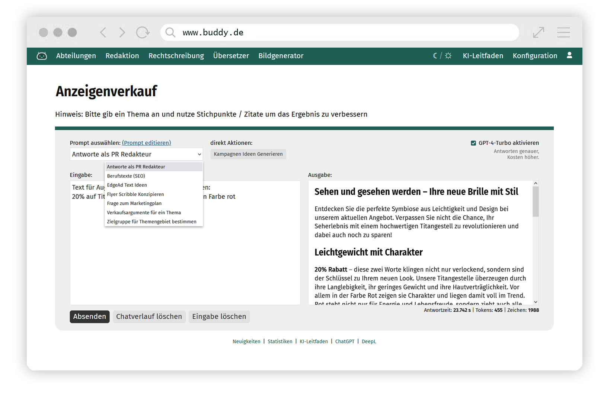

# GPT | Buddy	
Prompt Management System for Interaction with the ChatGPT API 

## Latest News
2026 Update to Response API
This Major update switches the current core, to use the improved responses API from OpenAI instead of the original chat API.

This enables features like tool calling and MCP server inclusion.
Please contact me before updating to the current Version as it will break backwards compatibility.

## Features
Configurable Prompt Database including lots of examples  
Interactive text generation based on predefined prompts with ChatGPT  
URL Scraping to inject Realtime information into our Prompts (e.g. Weather or Traffic data)
Image Detection features (Open AI Vision)
Fileuploads with Audiotranscribtion based on OpenAI Whisper
Text to Speech capeability
AI Image generation via Dall-E3  
Integrated User- and Rights-Management System  
Prompt usage statistics to identify workflows for your Company  

## Demonstration
For Demonstration purposes please contact stuff@artmessengers.de  
More information on: https://www.artmessengers.de/buddy/buddy-features.pdf

## Requirements
External OpenAI account (https://platform.openai.com)  
Webserver with PHP8 and MySQL Database  
preferablly Composer

## Installation
1. Important: Before you start you have to rename 4 Files:  
   example.env -> **.env**  
   app/config/example.config.php -> **config.php**  
   app/templates/navigation/example.main-nav.tpl -> **main-nav.tpl**
   app/templates/example.faq.tpl -> **faq.tpl**     
   public/styles/css/example.custom.css -> **custom.css**  
3. Add your Database credentials and the OpenAI-API Key (https://platform.openai.com) to you .env File
4. Optionally, in the .env file you can setup an SMTP-E-Mail Server (used for Password recovery) or define IP-Ranges that do not require Logins e.g. for Intranet Usage
5. Import the Prompt Database (supplied externally) into your Database (e.g. with PHP My Admin)
6. run "composer install"

## Configuration
In the config.php File you can setup Categories which you can use to seperate your Prompts into groups e.G. Editorial, Support, Sales.  
Prompt-Categories can be accessed like this: www.buddy.com/categoryname  
You should setup your navigation (app/tamples/navigation/main-nav.tpl) according to your Prompt-Categories

## Customization
You can change CSS in you custom.css File (public/styles/css/custom.css)  
Uncomment the :root Variables and change the colors to your liking e.g. blue --primary: #4585c4;
