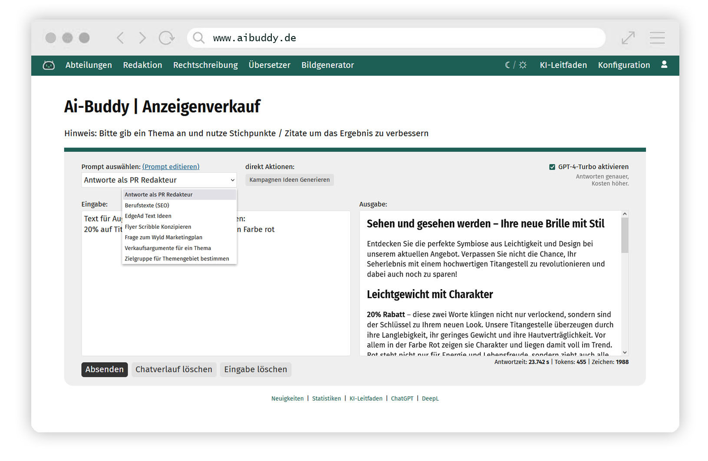

# GPT | Buddy	
Prompt Management System for Interaction with the ChatGPT API 

## Latest News
Important Information for the Prompt Temperatures Update from 2023-12-17  
The Update requires a new field in the prompt database called "temperatures", varchar(64) and null.  
As always before updating: rember to save your config.php, custom.css, main-nav.tpl and faq.tpl!!!

## Features
Configurable Prompt Database including lots of examples  
Interactive Text generation based on predefined prompts with ChatGPT  
Fileuploads with Audiotranscribtion based on OpenAI Whisper  
AI Image generation via Dall-E3  
Integrated User- and Rights-Management System  
Detailed prompt usage statistics to identify workflows for your Company  

## Demonstration
For Demonstration purposes please contact stuff@artmessengers.de  
More information on: https://www.artmessengers.de/aibuddy/ai-buddy-features.pdf

## Requirements
External OpenAI account (https://platform.openai.com)  
Webserver with PHP8 and MySQL Database  
preferablly Composer

## Installation
1. Important: Before you start you have to rename 3 Files:  
   example.env -> **.env**  
   app/config/example.config.php -> **config.php**  
   app/templates/navigation/example.main-nav.tpl -> **main-nav.tpl**  
   public/styles/css/example.custom.css -> **custom.css**  
2. Add your Database credentials and the OpenAI-API Key (https://platform.openai.com) to you .env File
3. Optionally, in the .env file you can setup an SMTP-E-Mail Server (used for Password recovery) or define IP-Ranges that do not require Logins e.g. for Intranet Usage
4. Import the Prompt Database (supplied after Licensing) into your Database (e.g. with PHP My Admin)
5. run "composer install"

## Configuration
In the config.php File you can setup Categories which you can use to seperate your Prompts into groups e.G. Editorial, Support, Sales.  
Prompt-Categories can be accessed like this: www.aibuddy.com/categoryname  
You should setup your navigation (app/tamples/navigation/main-nav.tpl) according to your Prompt-Categories

## Customization
You can change CSS in you custom.css File (public/styles/css/custom.css)  
Uncomment the :root Variables and change the colors to your liking e.g. blue --primary: #4585c4;
